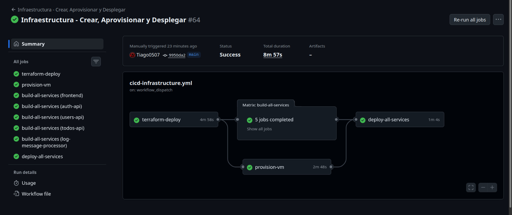
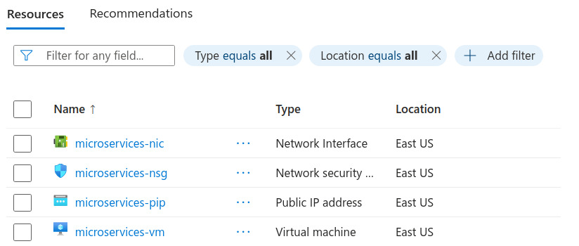
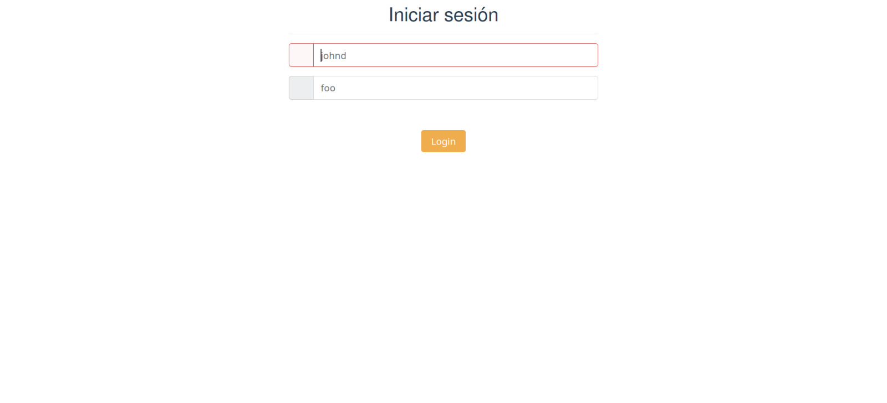
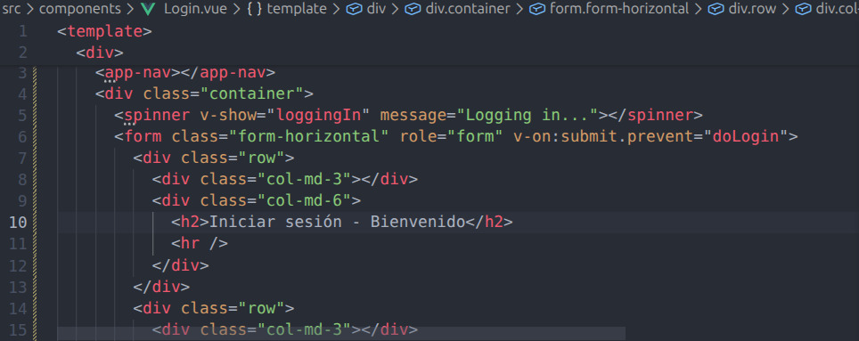
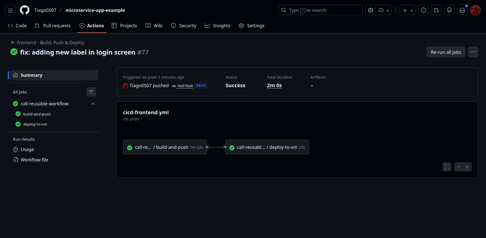
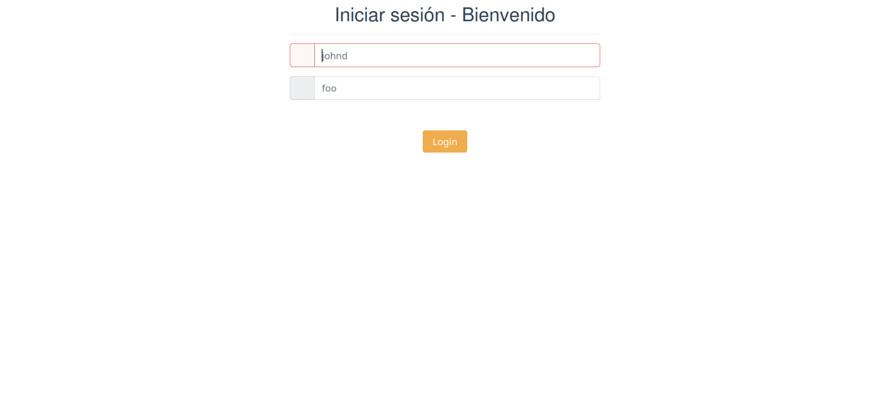
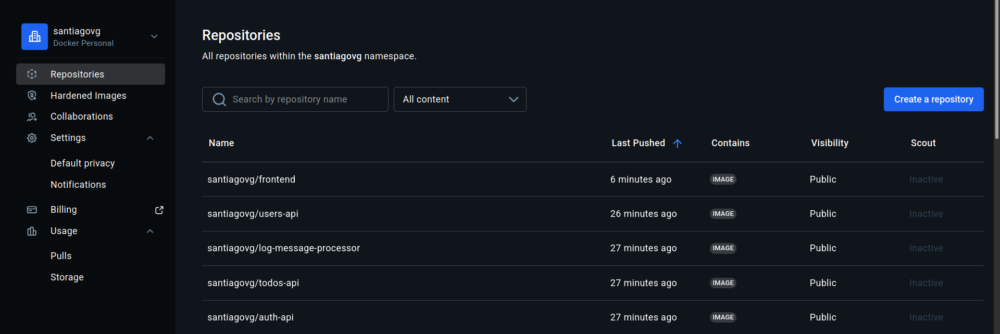

# Polyglot Microservices Application with Automated DevOps Pipelines

This repository contains a complete TODO application built on a microservices architecture. It showcases a diverse technology stack (Go, Java, Vue, Python, Node.js) and is fully managed by a robust, automated CI/CD pipeline using GitHub Actions, Terraform, and Ansible. The entire infrastructure and application deployment process is automated, from cloud resource provisioning to application updates.

**DevOps Engineers**:

- Santiago Valencia García - A00395902
- Danna Valentina López Muñoz - A00395625

**Original Project Authors**: @bortizf, based on @elgris' foundational work

**Professor**: DevOps and Cloud Engineer Christian David Flor Astudillo

**Course**: Software Engineering V

**Date**: September 29, 2025

Faculty of Engineering, Design and Applied Sciences

Icesi University. Cali, Valle del Cauca, Colombia

---

## Architecture Overview

The application is composed of five distinct microservices, a Redis cache, and a Zipkin instance for distributed tracing. The frontend acts as an API Gateway, routing requests to the appropriate backend services.


A detailed breakdown of each service and the implementation of cloud design patterns (Cache-Aside and Circuit Breaker) can be found in the [**Microservices Documentation**](./microservices/README.md).

---

## Repository Structure

This repository is organized into distinct directories, each with a specific responsibility. Each directory contains its own detailed `README.md` file.

- **`./iac/`**: Contains all the Infrastructure as Code written in Terraform. It defines all the necessary Azure cloud resources, such as the virtual machine, virtual network, and security groups.
  - [**-> Go to IaC Documentation**](./iac/README.md)
- **`./ansible/`**: Holds the **Ansible** playbooks for **Configuration Management**. These scripts are responsible for bootstrapping the server (installing Docker) and automating application deployments.
  - [**-> Go to Ansible Documentation**](./ansible/README.md)
- **`./microservices/`**: The core of the application. It contains the source code for each individual microservice, their Dockerfiles, and the implementation of the cloud design patterns.
  - [**-> Go to Microservices Documentation**](./microservices/README.md)
- **`./.github/workflows/`**: Defines all the **CI/CD pipelines** using **GitHub Actions**. This is where the entire automated workflow for infrastructure and application deployment is orchestrated.
  - [**-> Go to Pipelines Documentation**](./.github/workflows/README.md)

---

## Automated CI/CD Flow

The project is driven by a fully automated CI/CD process that separates infrastructure and application concerns.

1.  **Infrastructure Pipeline**: Triggered by changes in the `iac/` or `ansible/` directories. This GitHub Actions workflow uses Terraform to build (or rebuild) the Azure environment and then runs an Ansible playbook to provision the VM with Docker.
2.  **Application Pipelines**: Each microservice has its own pipeline that is triggered by code changes in its specific directory. These pipelines build a new Docker image, push it to Docker Hub, and then run an Ansible playbook to deploy the new version to the VM.

This entire flow is designed to be hands-off, enabling continuous delivery from a `git push`.

---

## Branching Strategy: Unified GitHub Flow

To maintain agility and a constantly deployable `main` branch, both the Development and Operations teams use a unified GitHub Flow strategy.

The `main` branch is always considered production-ready and is protected. All work is done on short-lived feature branches that are merged into `main` via Pull Requests (PRs).

#### **Branch Naming Convention**

To clearly distinguish the type of work, branches follow this convention: `<type>/<team>/<description>`

- **`<type>`**: `feature`, `fix`, `chore`, `hotfix`.
- **`<team>`**: `dev` for application development, `ops` for infrastructure or operations work.
- **`<description>`-**: A brief, kebab-case description of the task.

**Examples**:

- `feature/dev/add-user-profile-picture`
- `fix/ops/update-terraform-vm-size`
- `chore/dev/refactor-auth-service`

#### **Workflow**

1.  Create a new, descriptive branch from `main`.
2.  Commit changes to the branch.
3.  Push the branch and open a Pull Request to `main`.
4.  The PR must pass all automated CI checks and receive a mandatory code review from another team member.
5.  Once approved, the PR is merged into `main`, which automatically triggers the corresponding CD pipeline to deploy the changes.

---

## Getting Started: Automated Deployment

There is no manual setup required to deploy the application. The entire process is handled by the GitHub Actions CI/CD pipelines.

### Prerequisites

To enable the automation, the following secrets and variables must be configured in the GitHub repository settings (`Settings > Secrets and variables > Actions`):

- **Secrets**:
  - `AZURE_CREDENTIALS`: Service principal for authenticating with Azure.
  - `DOCKERHUB_USERNAME`: Your Docker Hub username.
  - `DOCKERHUB_TOKEN`: Your Docker Hub access token.
  - `SSH_PASSWORD`: The password for the admin user on the Azure VM.
  - `SSH_USERNAME`: The admin username for the Azure VM (e.g., `adminuser`).
  - `REPO_ACCESS_TOKEN`: A GitHub PAT to allow workflows to update repository variables.
- **Variables**:
  - `SSH_HOST`: This variable is created and managed automatically by the infrastructure pipeline. You do not need to set it initially.

### Triggering a Deployment

- **To Deploy Infrastructure**: Make a commit and push to the `main` branch with changes inside the `iac/` directory. This will trigger the `cicd-infrastructure.yml` workflow.
- **To Deploy a Microservice**: Make a commit and push to the `main` branch with changes inside a specific service's directory (e.g., `microservices/frontend/`). This will trigger that service's specific CI/CD workflow.

### Accessing the Application

Once the infrastructure pipeline has run successfully, the public IP of the virtual machine will be available in the logs of the pipeline run. The application will be accessible at: `http://<VM_PUBLIC_IP>:8080`.

### Cleanup

To destroy all the cloud resources created by the automation, you can run the `terraform destroy` command from the `iac` directory on your local machine after authenticating with Azure CLI.

```bash
# Navigate to the iac directory
cd iac

# Authenticate with Azure
az login

# Destroy all infrastructure
terraform destroy
```

---

## Live Deployment: From Infrastructure to Production

The following documentation captures the complete deployment workflow, demonstrating the end-to-end automation from infrastructure provisioning through application delivery and continuous updates.

### Infrastructure Pipeline Execution

The infrastructure pipeline orchestrates the provisioning of all Azure resources and the provisioning of the virtual machine with Docker. This workflow triggers automatically when changes are pushed to the `iac/` directory.



The pipeline executes three parallel jobs: infrastructure deployment via Terraform, VM provisioning through Ansible, and simultaneous building and pushing of all microservice images to Docker Hub.

### Azure Resources Deployment

Once the infrastructure pipeline completes, all necessary Azure resources are instantiated and configured. The resource group contains the virtual machine, virtual network, network security groups, and public IP address required to host and access the application.



The provisioning process configures a Standard_B2s Ubuntu 22.04 LTS virtual machine with Docker and Docker Compose pre-installed, ready to host the containerized microservices.

### Application Accessibility

Upon successful infrastructure deployment, the application becomes immediately accessible through the public IP address assigned to the virtual machine. The frontend service acts as the primary entry point, providing the user interface for interacting with the TODO application.



The frontend is deployed on port 8080, serving as a reverse proxy that routes API requests to the respective backend microservices. Authentication is required to access the application, leveraging the Auth API service built with Go.

### Continuous Delivery: Code Changes to Production

The repository implements a fully automated continuous delivery workflow. When developers commit changes to a microservice directory, GitHub Actions automatically builds the Docker image, pushes it to Docker Hub, and deploys the updated service to the running application.

#### Source Code Modification

Developers make code changes in their feature branches. In this example, a modification to the Login component was committed to enhance the user interface with a welcome label.



The change was made to the Vue.js Login component, demonstrating how frontend modifications flow through the pipeline.

#### Automated Pipeline Execution

Upon pushing the changes to the main branch, the frontend-specific CI/CD pipeline triggers automatically, executing the build, push, and deployment stages.



The pipeline completes in under three minutes, demonstrating the efficiency of containerized deployment. The new image is built, pushed to Docker Hub, and deployed to the running instance without any manual intervention.

#### Live Application Update

The updated application reflects the changes immediately after the pipeline completes. The new UI element is visible in the login interface, confirming that the continuous delivery pipeline successfully delivered the code change from git commit to production.



The entire flow from code change to production deployment occurs automatically, reducing deployment risk and enabling rapid iteration.

### Container Image Registry

All microservice images are published to Docker Hub, serving as the container registry for the deployment pipeline. The images are tagged with the `latest` tag, ensuring that the deployment playbooks always pull the most recent version.



The registry maintains images for all five microservices: frontend, auth-api, users-api, todos-api, and log-message-processor. Each image is built using optimized multi-stage Dockerfiles to minimize size and maximize security.
